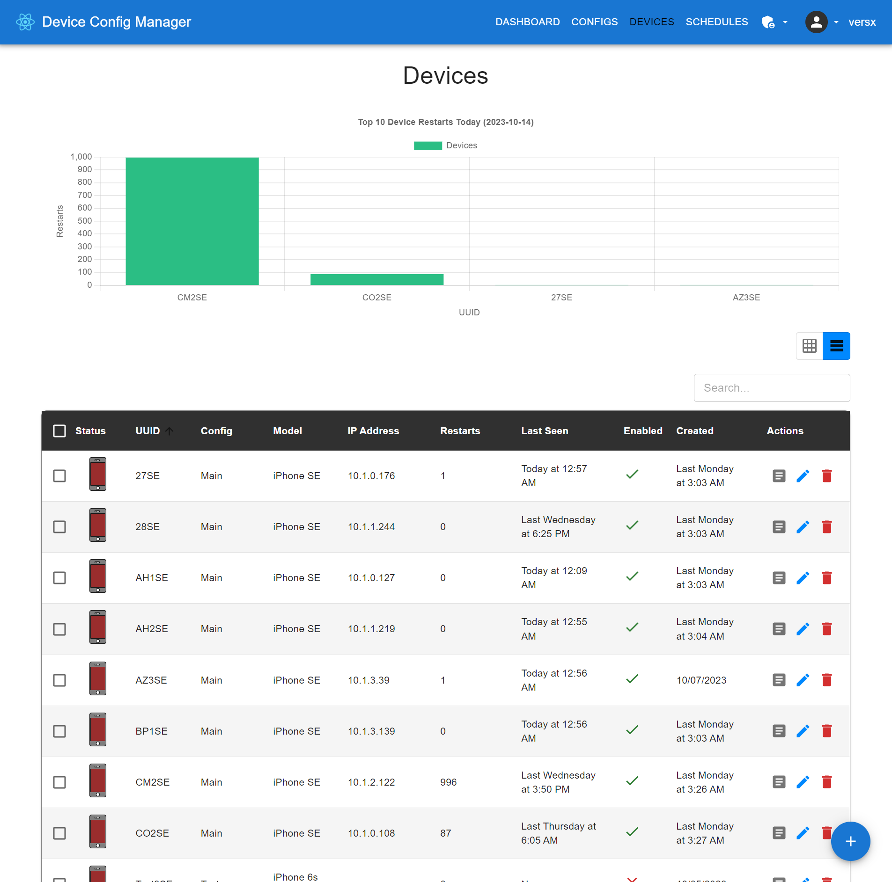
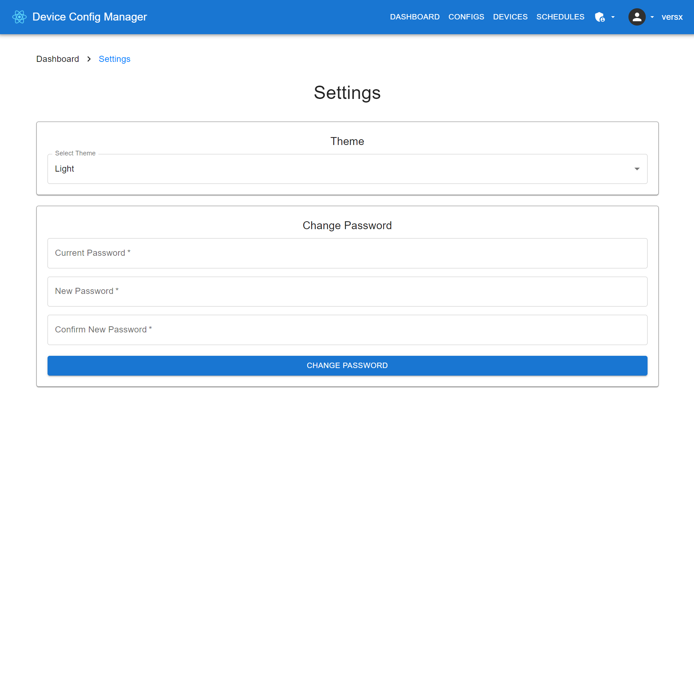

  

  

# Device Config Manager  

## Screenshots  
**Dashboard**  
  
| Configs | Devices (Grid) | Devices (Table) |  
| ------------- | ------------- | ------------- |  
|  |  |  |  

| Schedules | Settings |  
| ------------- | ------------- |  
|  |  |  

**Admin Dashboard**  
  
| Dashboard | Users | Settings |
| ------------- | ------------- | ------------- |
|  |  |  |
