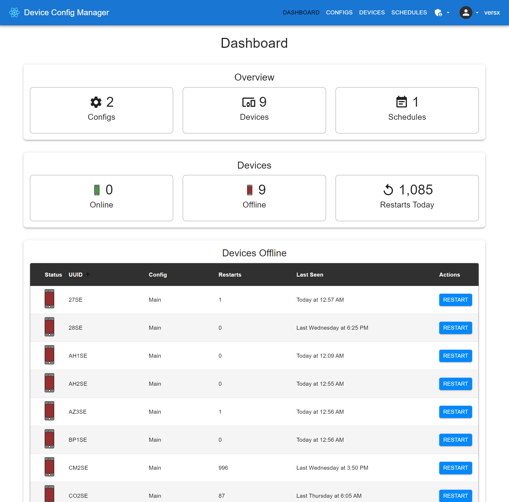
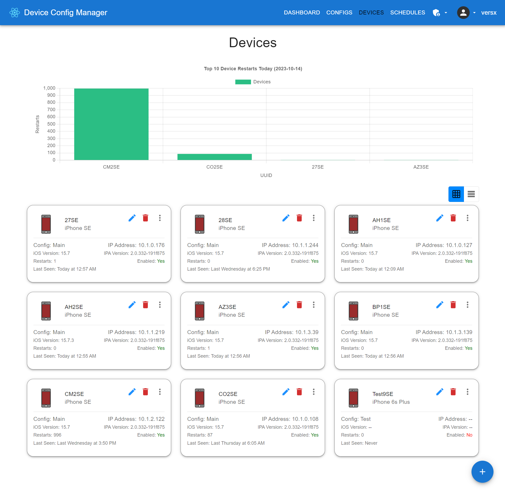
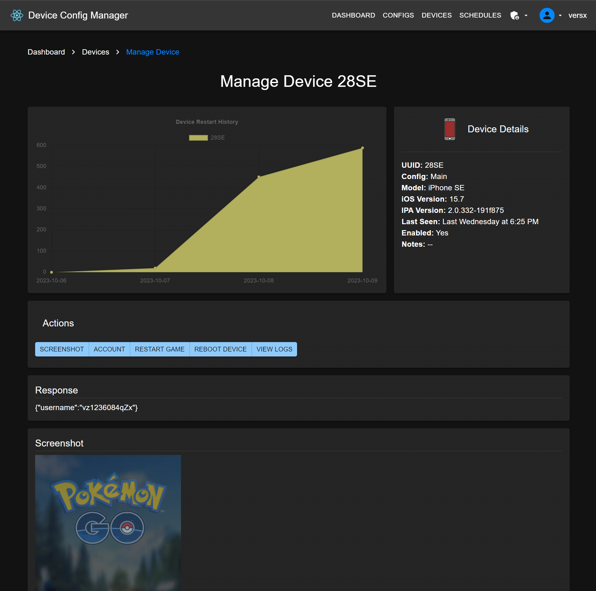
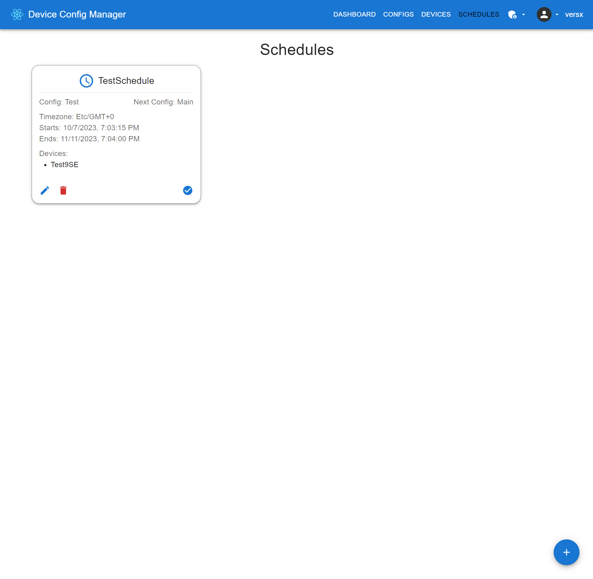
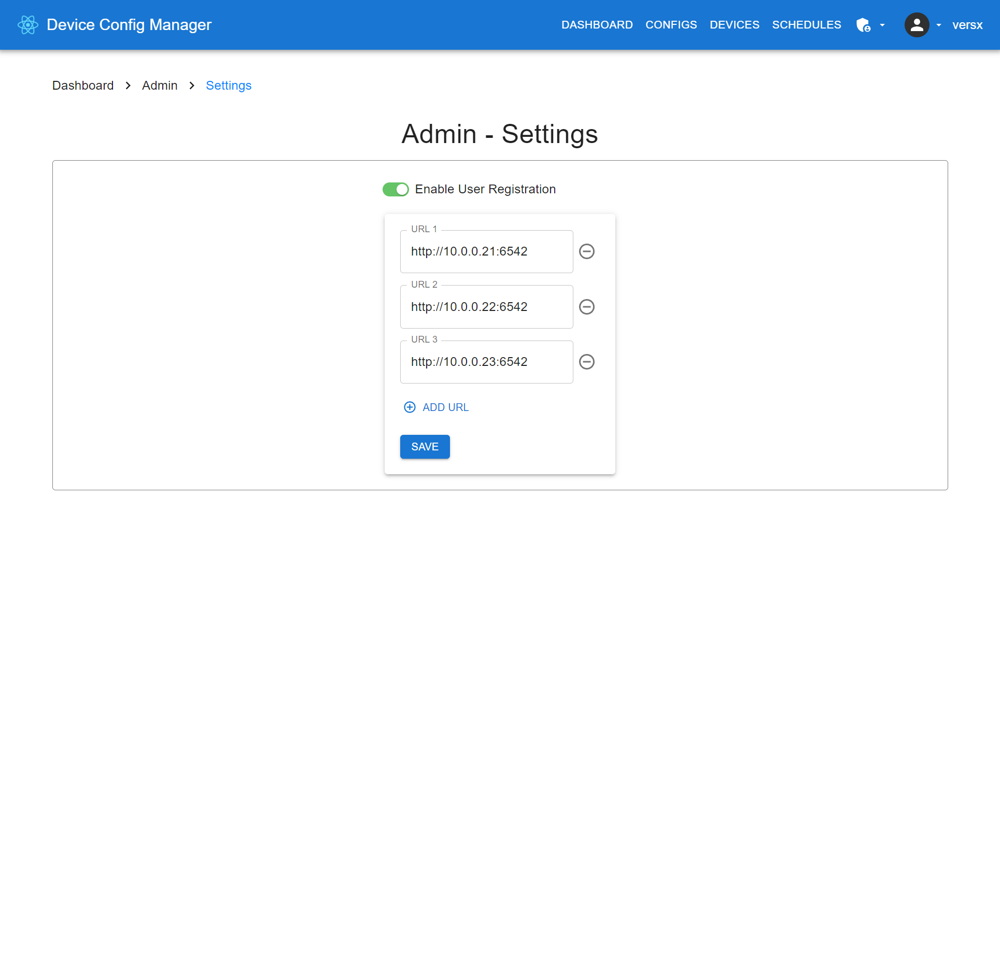

  

[](https://github.com/versx/DeviceConfigManager/releases/)
[](https://github.com/versx/DeviceConfigManager/graphs/contributors/)
[](https://discord.gg/zZ9h9Xa)  


# Device Config Manager  
To be used with RealDeviceMap macless solutions.  

Central repository for macless client configurations without having to keep track of multiple remote configs and urls. Assign different configurations to different devices and different backends (RealDeviceMap, Lorgnette, Golbat, etc).  

When a device connects for the first time an entry is created in the database. Otherwise, if the device does not have a config assigned and a default config is set, the default config will be auto-assigned.  

Manually creating devices ahead of time is also possible, if needed. Rest endpoint tooling to get device screenshot, currently logged in account username, restart game, reboot device, view device logs, and more.  


## Prerequisites
- [Node.js v18 or higher](https://nodejs.org/en/download)  


## Installation

1. Clone repository: `git clone https://github.com/versx/DeviceConfigManager dcm`  

### Client  
1. Install packages: `npm install`  
1. Copy example config: `cp src/config.example.json src/config.json`  
1. Fill out config options.  
1. Build project in root folder: `npm run build`  
1. Run: `npm run start`  

### Server  
1. Change directories: `cd server`  
1. Install packages: `npm install`  
1. Copy example config: `cp src/config.example.json src/config.json`  
1. Fill out config options.  
1. Build project in root folder: `npm run build`  
1. Run: `npm run start`  


## Updating  

### Client
1. Pull latest changes in root folder `git pull`  
1. Build client project in root folder: `npm run build`  
1. Run `npm run start`  

### Server
1. Pull latest changes in root folder `git pull`  
1. Change directories: `cd server`  
1. Build server project: `npm run build`  
1. Run `npm run start`  


## Configuration

### Client  
```json
{
  // Base API url address of server.
  "apiUrl": "http://127.0.0.1:9992/api/v2/"
}
```

### Server
```json
{
  // Host IP address to list on.
  "host": "0.0.0.0",
  // Port to listen on.
  "port": 9992,
  // Authorization options.
  "auth": {
    // Initial Administrator user account seed.
    "admin": {
      // Username for admin account.
      "username": "admin",
      // Password for admin account.
      "password": "p4ssw0rd!"
    },
    // Secret token used for creating JsonWebTokens (JWTs).
    "secret": "auth token",
    // MITM authorization bearer tokens allowed, leave blank to allow all.
    "bearerTokens": []
  },
  // Keep device IP addresses updated in database.
  "autoSyncIP": true,
  // Database options.
  "database": {
    // Database dialect to use. (i.e. mysql/mariadb)
    "dialect": "mysql",
    // Database host address.
    "host": "127.0.0.1",
    // Database listening port.
    "port": 3306,
    // Database account username.
    "username": "root",
    // Database account password.
    "password": "password",
    // Database name.
    "database": "dcmdb",
    // Timezone used for `createdAt` and `updatedAt` column values.
    "timezone": "America/Denver",
    // Whether to enable or disable Sequelize database
    // query logging.
    "logging": false
  },
  // Logging options.
  "logs": {
    // Log level to use. (none, trace, debug, info, warn, error)
    "level": "info",
    // Log color options.
    "colors": {
      "text": "#ffffff",
      "variable": "#ff624d",
      "date": "#4287f5",
      "warn": "#ffff00",
      "error": "#ff0000"
    },
    // Log rotation options.
    "rotate": {
      // How often to check if log file should be rotated
      "interval": "1h",
      // Maximum number of rotated log files to keep
      "maxFiles": 5,
      // Maximum size of log file before rotated
      "maxSize": "1M"
    }
  },
  // 
  "timezone": "America/Denver"
}
```


## Screenshots  
**Dashboard**  
[](.github/images/dashboard.png)  
| Configs | Devices (Grid) | Devices (Table) | Manage Device |  
| ------------- | ------------- | ------------- | ------------- |  
| <a href="https://raw.githubusercontent.com/versx/DeviceConfigManager/react/.github/images/configs.png"></a> | <a href="https://raw.githubusercontent.com/versx/DeviceConfigManager/react/.github/images/devices-grid.png"></a> | <a href="https://raw.githubusercontent.com/versx/DeviceConfigManager/react/.github/images/devices-table.png"></a>| <a href="https://raw.githubusercontent.com/versx/DeviceConfigManager/react/.github/images/devices-manage.png"></a> |  

| Schedules | Settings |  
| ------------- | ------------- |  
| <a href="https://raw.githubusercontent.com/versx/DeviceConfigManager/react/.github/images/schedules.png"></a> | <a href="https://raw.githubusercontent.com/versx/DeviceConfigManager/react/.github/images/settings.png"></a> |  

**Admin Dashboard**  
[](.github/images/admin-dashboard.png)  
| Users | Settings |
| ------------- | ------------- |  
| <a href="https://raw.githubusercontent.com/versx/DeviceConfigManager/react/.github/images/admin-users.png"></a> | <a href="https://raw.githubusercontent.com/versx/DeviceConfigManager/react/.github/images/admin-settings.png"></a> |
